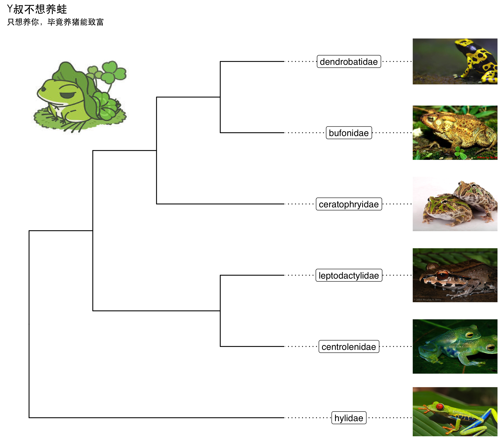

```r
require(ggtree)
require(ggimage)

nwk <- "((((bufonidae, dendrobatidae), ceratophryidae), (centrolenidae, leptodactylidae)), hylidae);"

x = read.tree(text = nwk)
p <- ggtree(x) + xlim(NA, 7) + ylim(NA, 6.2) +
    geom_tiplab(aes(image=paste0(label, '.jpg')), geom="image", offset=2, align=2, size=.2)  + 
    geom_tiplab(geom='label', offset=1, hjust=.5) + 
    geom_image(x=.8, y=5.5, image="frog.jpg", size=.2)  + 
    ggtitle("Y叔不想养蛙", subtitle="只想养你，毕竟养猪能致富")

p <- p + theme(plot.title=element_text(family="STHeiti"), plot.subtitle=element_text(family="STHeiti"))
ggsave(p, file="ggtree_frog.png", width=8.5, height=7.5)
```


